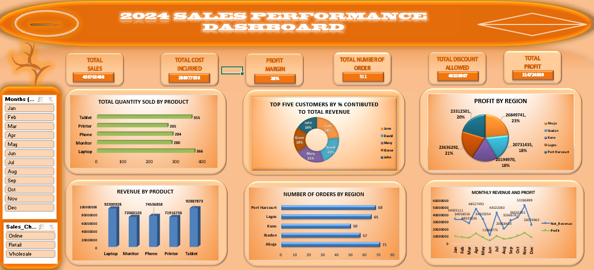

# Sales Performance Analysis & Dashboard

## Project Overview
This project analyzes sales data using Microsoft Excel to evaluate sales,
profitability, costs, discounts, and overall business performance.

## Dashboard Preview

## Objectives
- Clean and prepare sales data for analysis
- Analyze sales performance across different dimensions
- Evaluate profitability and cost performance
- Compare year-on-year performance
- Present insights through an interactive dashboard

## Tools Used
- Microsoft Excel
- Pivot Tables
- Excel Formulas
- Slicers
- Data Cleaning
- Data Visualization

## Analysis Performed
- Sales performance by product
- Sales performance by region
- Customer analysis
- Sales channel analysis
- Profitability analysis
- Cost and discount analysis
- Year-on-year performance analysis

## Key Skills Demonstrated
- Data Cleaning
- Exploratory Data Analysis
- Data Visualization
- Dashboard Development
- Business Performance Analysis
- Excel Data Analysis

## Project Files
- `Sales_Performance_Analysis.xlsx` – Complete Excel analysis and dashboard
- `dashboard.png` – Preview of the interactive dashboard
